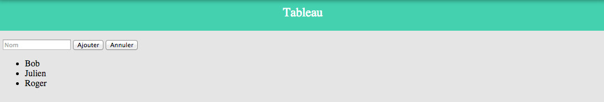

FOAD Simplonline - Semaine 9

Création d'un annuaire basique en JS (Fonction ajouter / rechercher / afficher)
 

Création d'un tableau basique en JS (Fonction ajouter / annuler)
 

Création d'une liste dont le CSS peut être changé via JS
 